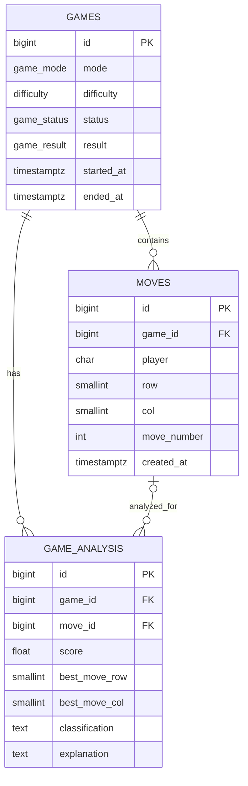

# CaroAI — Database Design (Sprint 1)

> **Trạng thái:** Tài liệu thiết kế đề xuất cho Sprint 1, chưa phải contract đã được xác nhận đầy đủ bởi backend/API hoặc game logic. Phạm vi `users` thuộc Database của Member 5 theo phân công Sprint 1, nhưng contract cho bảng này chưa có trong repository. Các điểm chờ M1/team được liệt kê ở cuối tài liệu.

## 1. Mục tiêu database

Thiết kế này đề xuất cách lưu game Caro, các nước đi và dữ liệu phân tích trong PostgreSQL. Thiết kế giữ các giá trị enum và luật bàn cờ đã có trong specification, đồng thời để mở các quyết định phụ thuộc vào contract của M1.

Phạm vi Database Sprint 1 của Member 5 gồm ERD, `users`, `games`, `moves`, `game_analysis` và quan hệ giữa các bảng. `games`, `moves` và `game_analysis` có proposal schema bên dưới. `users` thuộc scope nhưng repository hiện chưa có contract để xác định schema hoặc relationship; phần này được ghi nhận là blocked, không được hiểu là đã thiết kế.

### 1.1 Trạng thái implementation hiện tại

`app/db/models.py` hiện khai báo các model `Game`, `Move` và `GameAnalysis`. Các phần đã có trong model gồm BIGINT Identity theo proposal, các cột/timestamp đã khai báo, FK, CHECK cho tọa độ/player/move number, `UNIQUE (game_id, move_number)`, nullable `game_analysis.move_id`, quan hệ ORM Game–Move và Game–GameAnalysis, cùng index trên `game_analysis.game_id`.

Các bảng/schema trong tài liệu vẫn là proposal. Model hiện chưa enforce enum values, chưa có `UNIQUE (game_id, row, col)`, chưa có composite FK hoặc relationship ORM GameAnalysis–Move, và chưa cấu hình cascade. Các mục này cùng các quyết định khác chỉ trở thành contract sau khi M1/team xác nhận.

## 2. Công nghệ

- **Database:** PostgreSQL.
- **ORM:** SQLAlchemy.
- **Timestamps:** PostgreSQL `TIMESTAMP WITH TIME ZONE` (`timestamptz`), biểu diễn thời điểm tuyệt đối; ứng dụng thống nhất ghi và xử lý thời điểm theo UTC.
- **ID:** Đề xuất dùng `BIGINT GENERATED ALWAYS AS IDENTITY` cho các primary key. Cần xác nhận kiểu ID này tương thích với contract/backend của M1 trước khi triển khai.

Kiểu enum dưới đây mô tả tập giá trị được phép. Cách cài đặt bằng PostgreSQL ENUM hay CHECK constraint là quyết định triển khai, chưa được chốt.

## 3. Schema đề xuất

### 3.1 `games`

| Column | PostgreSQL type | Nullable | Default | Key / constraint |
|---|---|---:|---|---|
| `id` | `BIGINT GENERATED ALWAYS AS IDENTITY` | No | Tự sinh | Primary key |
| `mode` | Enum: `HUMAN_VS_AI`, `HUMAN_VS_HUMAN` | No | — | Chỉ nhận các giá trị đã liệt kê |
| `difficulty` | Enum: `EASY`, `MEDIUM`, `HARD` | Yes | — | Chỉ nhận các giá trị đã liệt kê; quy tắc null theo mode chờ M1 xác nhận |
| `status` | Enum: `IN_PROGRESS`, `X_WON`, `O_WON`, `DRAW` | No | `IN_PROGRESS` | Chỉ nhận các giá trị đã liệt kê |
| `result` | Enum: `X_WON`, `O_WON`, `DRAW` | Yes | — | Có thể null khi game đang diễn ra; ý nghĩa và tính nhất quán với `status` chờ M1 xác nhận |
| `started_at` | `TIMESTAMP WITH TIME ZONE` | No | `CURRENT_TIMESTAMP` | Thời điểm UTC |
| `ended_at` | `TIMESTAMP WITH TIME ZONE` | Yes | — | Thời điểm UTC; quy tắc khi nào có giá trị chờ M1 xác nhận |

`result` được giữ theo danh sách cột yêu cầu, dù các giá trị kết thúc hiện cũng xuất hiện trong `status`. Không có constraint đồng bộ `result`, `status` hoặc `ended_at` trong proposal này vì quy tắc chuyển trạng thái chưa được xác nhận.

### 3.2 `moves`

| Column | PostgreSQL type | Nullable | Default | Key / constraint |
|---|---|---:|---|---|
| `id` | `BIGINT GENERATED ALWAYS AS IDENTITY` | No | Tự sinh | Primary key |
| `game_id` | `BIGINT` | No | — | Foreign key → `games.id` |
| `player` | `CHAR(1)` | No | — | CHECK: giá trị là `X` hoặc `O` |
| `row` | `SMALLINT` | No | — | CHECK: `0 <= row <= 14` |
| `col` | `SMALLINT` | No | — | CHECK: `0 <= col <= 14` |
| `move_number` | `INTEGER` | No | — | CHECK: `move_number > 0`; unique trong phạm vi một game |
| `created_at` | `TIMESTAMP WITH TIME ZONE` | No | `CURRENT_TIMESTAMP` | Thời điểm UTC |

Constraints unique đề xuất:

- `UNIQUE (game_id, move_number)` — không trùng số thứ tự move trong cùng game.
- `UNIQUE (game_id, row, col)` — ngăn hai bản ghi move chiếm cùng ô trong cùng game. Cần M1 xác nhận tính tương thích với mọi thao tác move mà contract hỗ trợ.

Foreign key `game_id` trỏ tới `games.id`. `ON DELETE CASCADE` là một lựa chọn đề xuất, chưa chốt; cần thống nhất chính sách xóa dữ liệu trước khi triển khai.

### 3.3 `game_analysis`

| Column | PostgreSQL type | Nullable | Default | Key / constraint |
|---|---|---:|---|---|
| `id` | `BIGINT GENERATED ALWAYS AS IDENTITY` | No | Tự sinh | Primary key |
| `game_id` | `BIGINT` | No | — | Foreign key → `games.id` |
| `move_id` | `BIGINT` | Yes | — | Tham chiếu move được phân tích; có thể null |
| `score` | `DOUBLE PRECISION` | Yes | — | Chưa quy định miền giá trị hoặc ý nghĩa/đơn vị |
| `best_move_row` | `SMALLINT` | Yes | — | Nếu có giá trị thì CHECK `0..14` |
| `best_move_col` | `SMALLINT` | Yes | — | Nếu có giá trị thì CHECK `0..14` |
| `classification` | `TEXT` | Yes | — | Chưa quy định tập giá trị hoặc miền hợp lệ |
| `explanation` | `TEXT` | Yes | — | Chưa quy định cấu trúc/nội dung |

`game_id` tham chiếu `games.id`. `move_id` nullable và chưa có UNIQUE constraint; proposal không giả định mỗi move chỉ có một analysis.

**Composite foreign key tùy chọn:** Nếu cần bảo đảm move được phân tích thuộc cùng game với bản ghi analysis, dùng foreign key ghép `(game_id, move_id)` tham chiếu `moves(game_id, id)`. PostgreSQL yêu cầu cột mục tiêu được bảo vệ bởi unique constraint, nên cần thêm `UNIQUE (game_id, id)` vào `moves` ngoài primary key `id`. Constraint này là đề xuất để bảo đảm tính nhất quán giữa game và move; cần xác nhận trước khi triển khai. Với `move_id = NULL`, liên kết tới move không được áp dụng, phù hợp trạng thái nullable đã nêu.

Nếu không dùng composite foreign key, foreign key đơn `move_id → moves.id` vẫn có thể tham chiếu move của game khác; cần M1/team quyết định có cần bảo đảm cùng game ở tầng database không.

Không ép miền giá trị cho `score` hoặc `classification`. Không áp đặt số lượng analysis trên mỗi move.

## 4. Users — thuộc scope, blocked do thiếu contract

Bảng `users` thuộc scope Database của Member 5 theo phân công Sprint 1. Tuy nhiên, repository hiện không có contract `users` đủ để thiết kế hoặc triển khai bảng này. Vì thiếu contract, M5 chưa được tự quyết định:

- Columns của `users`.
- Primary key hoặc kiểu dữ liệu của primary key.
- Authentication/login.
- Relationship giữa `users` và `games`.
- Có hay không cột `user_id` trong `games`.
- Delete behavior giữa `users` và các bảng liên quan.

Do đó tài liệu này không đề xuất schema `users`, không tạo User model và không thêm node `users` vào ERD cho tới khi M1/team xác nhận contract. Không suy ra email, password, username, authentication hoặc quan hệ user-game từ các nội dung khác trong repository.

## 5. Relationships và khóa

- `games` **1 — N** `moves`: một game có thể có nhiều move; mỗi move thuộc một game qua `moves.game_id`.
- `games` **1 — N** `game_analysis`: mỗi analysis thuộc một game qua `game_analysis.game_id`.
- `moves` **0..1 — N** `game_analysis`: mỗi analysis có thể không tham chiếu move hoặc tham chiếu một move qua `game_analysis.move_id`; chưa giới hạn số analysis trên một move.
- `users` thuộc scope M5 nhưng chưa có contract; không xác định relationship `users` với bảng nào.
- Mỗi bảng được thiết kế có primary key `id`. Foreign key và tùy chọn composite foreign key được mô tả trong các phần schema tương ứng.

## 6. Constraints và indexes

### 6.1 Constraints đề xuất

- `games.mode` chỉ nhận `HUMAN_VS_AI` hoặc `HUMAN_VS_HUMAN`.
- `games.difficulty` chỉ nhận `EASY`, `MEDIUM` hoặc `HARD`, hoặc null.
- `games.status` chỉ nhận `IN_PROGRESS`, `X_WON`, `O_WON` hoặc `DRAW`.
- `games.result` chỉ nhận `X_WON`, `O_WON` hoặc `DRAW`, hoặc null.
- `moves.player` chỉ nhận `X` hoặc `O`.
- `moves.row` và `moves.col` nằm trong `0..14`.
- `moves.move_number > 0`.
- `UNIQUE (game_id, move_number)` trên `moves`.
- `UNIQUE (game_id, row, col)` trên `moves` — đề xuất chờ M1 xác nhận.
- `game_analysis.best_move_row` và `best_move_col`, nếu có giá trị, nằm trong `0..14`.
- Nếu bật composite foreign key: `UNIQUE (game_id, id)` trên `moves` và FK `(game_id, move_id)` từ `game_analysis` tới `moves(game_id, id)`.

Không đề xuất constraint liên kết `status`, `result`, `ended_at` hoặc `mode`, `difficulty` cho tới khi M1 xác nhận quy tắc tương ứng.

### 6.2 Indexes đề xuất

- Unique constraint `UNIQUE (game_id, move_number)` tạo index phục vụ tra cứu/đọc moves theo thứ tự trong một game; không cần tạo thêm index trùng trên cùng cột.
- `game_analysis(game_id)` để tra analysis theo game.
- `game_analysis(move_id)` để tra analysis theo move nếu workload cần truy vấn này.
- Nếu dùng composite FK, unique constraint `UNIQUE (game_id, id)` cung cấp index cần cho cột đích của FK; đánh giá xem index này có cần thiết ngoài yêu cầu FK và truy vấn thực tế hay không.

PostgreSQL không tự tạo index trên cột tham chiếu của foreign key. Các index ngoài unique constraint là đề xuất theo nhu cầu truy vấn, chưa phải quyết định hiệu năng đã chốt.

## 7. Quy tắc dữ liệu bàn cờ và thời gian

- Bàn cờ có kích thước **15 × 15**.
- `row` và `col` dùng chỉ số từ `0` đến `14`, bao gồm hai đầu.
- Các tọa độ best move, nếu có, cũng nằm trong `0..14`.
- `player` chỉ nhận `X` hoặc `O`.
- `started_at`, `ended_at`, `created_at` dùng `TIMESTAMP WITH TIME ZONE`; default thời gian hiện tại được đề xuất cho `started_at` và `created_at`.
- Các thời điểm được ứng dụng ghi/diễn giải theo UTC. `timestamptz` lưu thời điểm tuyệt đối; cách hiển thị phụ thuộc timezone của phiên kết nối.

## 8. ERD

ERD thể hiện các quan hệ trong proposal cho ba bảng đã có schema. `move_id` trong `GAME_ANALYSIS` vẫn nullable; hình vẽ thể hiện liên kết tùy chọn theo cột `move_id`, nhưng không khẳng định composite FK hay cardinality đặc biệt. Tùy chọn composite FK và `UNIQUE (game_id, id)` được mô tả ở trên, không làm `move_id` bắt buộc. `users` thuộc scope M5 nhưng không có node trong ERD vì chưa có contract để xác định schema hoặc relationship; không suy diễn quan hệ users với games hay bảng nào khác.

## 9. Open decisions / Team dependencies

Các mục sau là quyết định mở, không phải contract đã chốt. M1/team cần xác nhận trước khi schema tương ứng được coi là hoàn tất:

1. **ID type cuối cùng:** xác nhận BIGINT Identity theo proposal có tương thích contract/backend hay cần kiểu khác.
2. **Enum enforcement:** chọn PostgreSQL ENUM, CHECK constraint hay cách khác cho các tập giá trị đã nêu.
3. **Difficulty/mode:** xác nhận nullability hoặc quy tắc của `difficulty` theo `mode`.
4. **Status/result:** xác nhận semantics, quan hệ giữa hai cột, trạng thái kết thúc và quy tắc `ended_at`.
5. **Move number:** xác nhận quy ước giá trị bắt đầu; model hiện chỉ yêu cầu lớn hơn 0.
6. **Undo/replay và unique cell:** xác nhận hành vi undo/replay và có chấp thuận `UNIQUE (game_id, row, col)` hay không.
7. **`game_analysis.move_id`:** xác nhận dùng FK đơn hay composite FK `(game_id, move_id)` để buộc analysis và move thuộc cùng game.
8. **Analysis cardinality:** xác nhận analysis gắn với game/move thế nào và có giới hạn số analysis trên mỗi move không.
9. **Delete/cascade:** xác nhận delete behavior, gồm việc có dùng cascade hay không.
10. **Index `game_analysis.move_id`:** xác nhận workload có cần index này không.
11. **Toàn bộ contract `users`:** xác nhận columns, PK/type, authentication, relationship với games, có `user_id` trong games hay không, và delete behavior. M5 không tự thiết kế các mục này trước khi có contract.
12. **Analysis fields:** xác nhận kiểu/ý nghĩa score, tập giá trị classification và cấu trúc explanation trước khi thêm miền hoặc constraint.

## 10. Các quyết định chưa thể chốt

Repository đã có các SQLAlchemy model nền cho `games`, `moves` và `game_analysis`, nhưng chưa có API contract/game logic đầy đủ để xác nhận các quyết định mở ở mục 9. `users` thuộc scope M5 nhưng chưa có contract trong repository và chưa có model; không được tự tạo schema trước khi M1/team xác nhận.

Đây là tài liệu thiết kế database cho Sprint 1, không định nghĩa API endpoint, `GameState`, authentication, business logic hay AI logic. Các lựa chọn được đánh dấu chờ xác nhận phải được M1/team thống nhất trước khi chuyển thành schema triển khai.
